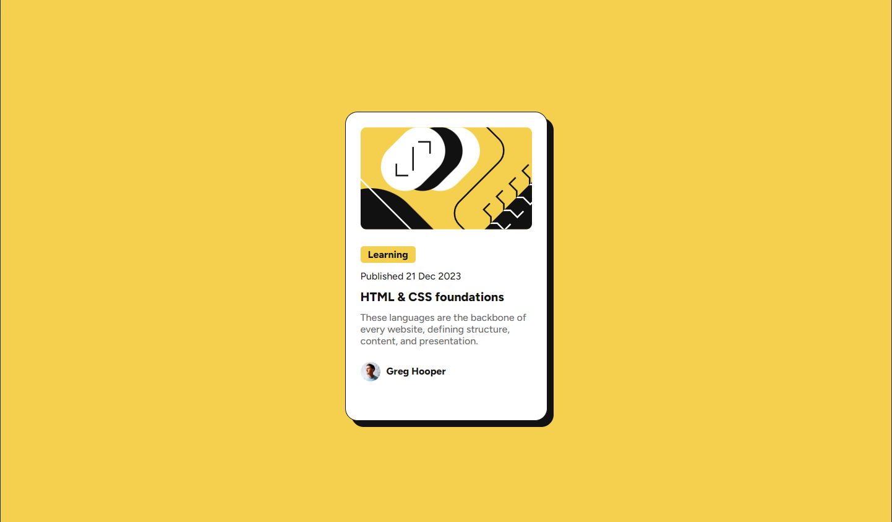

# Frontend Mentor - Blog preview card solution

This is a solution to the [Blog preview card challenge on Frontend Mentor](https://www.frontendmentor.io/challenges/blog-preview-card-ckPaj01IcS). Frontend Mentor challenges help you improve your coding skills by building realistic projects.

## Table of contents

- [Overview](#overview)
  - [The challenge](#the-challenge)
  - [Screenshot](#screenshot)
  - [Links](#links)
- [My process](#my-process)
  - [Built with](#built-with)
  - [What I learned](#what-i-learned)
  - [Continued development](#continued-development)
- [Author](#author)
- [Acknowledgments](#acknowledgments)

## Overview

### The challenge

Users should be able to:

- See hover and focus states for all interactive elements on the page

### Screenshot

### Links

- Live Site URL: [Live Site](https://frontendmentor-blogpreviewcard182028.netlify.app)

## My process

### Built with

- Semantic HTML5 markup
- CSS custom properties
- Flexbox
- Mobile-first workflow

### What I learned

Este desafío me ayudo a ver las distintas etiquetas que hay y que no conocía, en este caso con la etiqueta <time>.

### Continued development

I need to review some things, like image management, learn more about semantic html and the different displays (block, inline-block, etc.).

## Author

- Website - [Website](https://frontendmentor-blogpreviewcard182028.netlify.app)
- Frontend Mentor - [@Pogo182028](https://www.frontendmentor.io/profile/Pogo182028)
